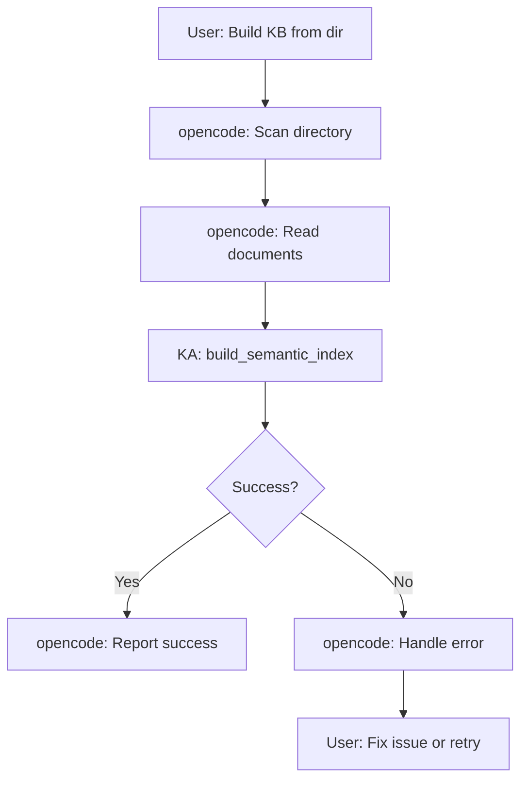
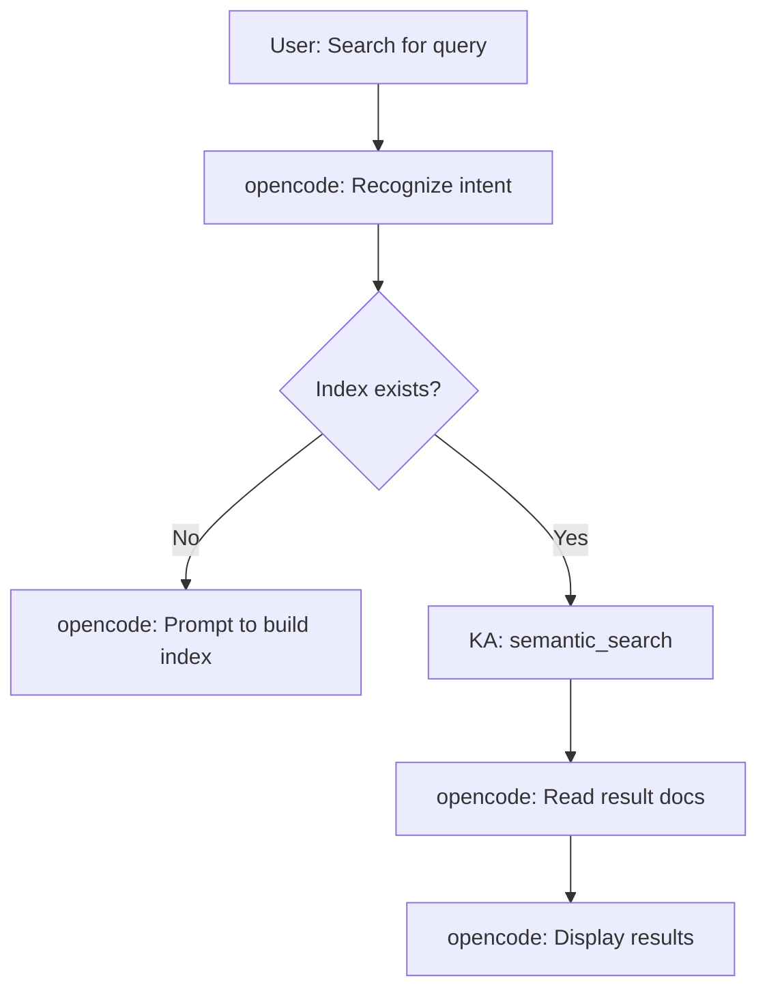
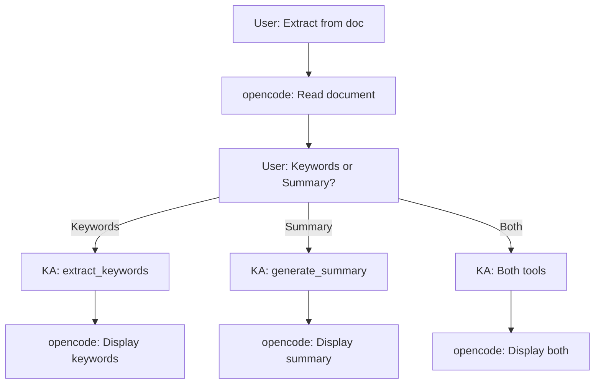
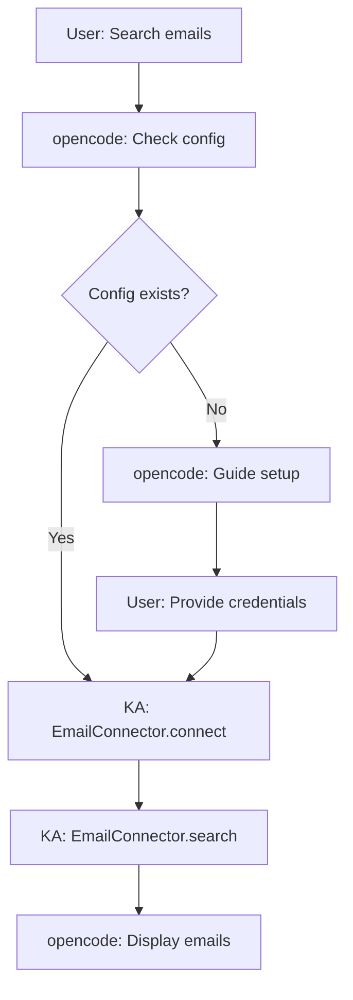

# Knowledge Assistant Agent Configuration

> 🤖 Agent configuration for opencode integration

**Version**: v1.1  
**Last Updated**: 2026-03-07  
**Author**: Integration Team  
**Status**: Production Ready

---

## 📖 Overview

**Knowledge Assistant Agent** is a specialized agent that provides intelligent knowledge management capabilities to opencode. It serves as a bridge between user intents and the Knowledge Assistant tool library.

### Agent Identity

- **Name**: Knowledge Assistant
- **Type**: Specialized Tool Agent
- **Role**: Knowledge Management Specialist
- **Capabilities**: Semantic indexing, intelligent search, knowledge extraction, multi-source integration

### Relationship with opencode

```
┌─────────────────────────────────────────────────┐
│              opencode (Master Agent)             │
│  ┌────────────────────────────────────────────┐ │
│  │  User Interaction                          │ │
│  │  - Natural language understanding         │ │
│  │  - Intent recognition                     │ │
│  │  - File operations (scan, read, write)    │ │
│  │  - Result presentation                    │ │
│  └────────────────────────────────────────────┘ │
│                     ↓ Calls                     │
│  ┌────────────────────────────────────────────┐ │
│  │    Knowledge Assistant Agent               │ │
│  │  ┌──────────────────────────────────────┐ │ │
│  │  │  Intent → Tool Mapping               │ │ │
│  │  │  - build_knowledge_base              │ │ │
│  │  │  - search_documents                  │ │ │
│  │  │  - extract_knowledge                 │ │ │
│  │  │  - multi_source_search               │ │ │
│  │  └──────────────────────────────────────┘ │ │
│  │                   ↓ Invokes                │ │
│  │  ┌──────────────────────────────────────┐ │ │
│  │  │    Knowledge Assistant Tools         │ │ │
│  │  │  - build_semantic_index()            │ │ │
│  │  │  - semantic_search()                 │ │ │
│  │  │  - extract_keywords()                │ │ │
│  │  │  - generate_summary()                │ │ │
│  │  │  - EmailConnector                    │ │ │
│  │  └──────────────────────────────────────┘ │ │
│  └────────────────────────────────────────────┘ │
└─────────────────────────────────────────────────┘
```

**Key Principle**: opencode delegates algorithmic tasks to Knowledge Assistant, which returns structured data. opencode then handles presentation and user interaction.

---

## 🎯 Core Capabilities

### 1. Knowledge Base Management

**Description**: Build and maintain semantic indexes of document collections.

**When Used**: User wants to create or update a knowledge base.

**Tools Called**: `build_semantic_index()`

**Workflow**:
1. opencode scans directory for documents
2. opencode reads document contents
3. Knowledge Assistant builds semantic index
4. opencode reports results to user

**Example**:
```python
# User: "Build knowledge base from ./notes"

# opencode actions:
documents = []
for path in scan_directory("./notes"):
    content = read_file(path)
    documents.append({'content': content, 'metadata': {'path': path}})

# Knowledge Assistant tool call:
result = build_semantic_index(documents, index_path=".ka-index")

# opencode response:
display(f"✓ Indexed {result['total_docs']} documents in {result['build_time']}")
```

---

### 2. Semantic Search

**Description**: Search documents using natural language queries with semantic understanding.

**When Used**: User wants to find relevant documents.

**Tools Called**: `semantic_search()`

**Workflow**:
1. opencode understands user's search intent
2. Knowledge Assistant performs semantic search
3. opencode reads and displays matching documents

**Example**:
```python
# User: "Find documents about Python async programming"

# Knowledge Assistant tool call:
results = semantic_search("Python async programming", top_k=5)

# opencode actions:
for result in results:
    doc_path = result['metadata']['path']
    content = read_file(doc_path)
    display_result(
        title=result['metadata'].get('title', doc_path),
        snippet=result['snippet'],
        similarity=result['similarity'],
        full_content=content
    )
```

---

### 3. Knowledge Extraction

**Description**: Extract keywords and generate summaries from documents.

**When Used**: User wants to understand document content quickly.

**Tools Called**: `extract_keywords()`, `generate_summary()`

**Workflow**:
1. opencode reads document content
2. Knowledge Assistant extracts keywords/summary
3. opencode presents extracted knowledge

**Example**:
```python
# User: "Extract keywords from ./notes/python.md"

# opencode action:
content = read_file("./notes/python.md")

# Knowledge Assistant tool call:
keywords = extract_keywords(content, method="textrank", top_n=10)

# opencode response:
display_keywords(keywords)
```

---

### 4. Multi-Source Integration

**Description**: Search across multiple data sources (documents, emails, etc.).

**When Used**: User wants to search emails or multiple sources.

**Tools Called**: `EmailConnector`, `semantic_search()`

**Workflow**:
1. opencode recognizes multi-source intent
2. Knowledge Assistant searches each source
3. opencode merges and presents unified results

**Example**:
```python
# User: "Search emails for project budget"

# Knowledge Assistant tool calls:
email_config = load_email_config()
with EmailConnector(email_config) as connector:
    email_results = connector.search("project budget", limit=5)

# opencode response:
display_email_results(email_results)
```

---

## 🗺️ Intent Mapping

### Intent Recognition Patterns

| User Intent | Trigger Patterns | Mapped Tool | Priority |
|-----------|-----------------|-------------|----------|
| **build_knowledge_base** | "build knowledge base", "create index", "构建知识库" | `build_semantic_index()` | P0 |
| **search_documents** | "search for", "find documents", "搜索文档" | `semantic_search()` | P0 |
| **extract_keywords** | "extract keywords", "关键词提取" | `extract_keywords()` | P1 |
| **generate_summary** | "summarize", "生成摘要" | `generate_summary()` | P1 |
| **search_emails** | "search emails", "搜索邮件" | `EmailConnector.search()` | P1 |
| **multi_source_search** | "search all sources", "全局搜索" | Multiple tools | P2 |

### Intent Recognition Flow

```
User Input
    ↓
opencode NLU Engine
    ↓
Intent Classification
    ├── "build knowledge base" → build_knowledge_base
    ├── "search for X" → search_documents
    ├── "extract keywords" → extract_knowledge
    └── "search emails" → multi_source_search
    ↓
Parameter Extraction
    ├── Extract: directory, query, filters
    └── Validate: required parameters present
    ↓
Tool Invocation
    └── Call appropriate Knowledge Assistant tool
    ↓
Result Processing
    └── Return structured data to opencode
    ↓
User Presentation
    └── opencode displays results
```

---

## 🔄 Workflow Descriptions

### Workflow 1: Build Knowledge Base

**Trigger**: User wants to index a document collection.

**Steps**:



**Detailed Flow**:

1. **User Request**
   ```
   User: "Build knowledge base from ./notes"
   ```

2. **opencode Intent Recognition**
   ```python
   intent = recognize_intent("Build knowledge base from ./notes")
   # intent = {
   #     'type': 'build_knowledge_base',
   #     'parameters': {'directory': './notes'}
   # }
   ```

3. **opencode File Operations**
   ```python
   directory = intent['parameters']['directory']
   documents = []
   
   for file_path in scan_directory(directory, recursive=True):
       if is_supported_file(file_path):
           content = read_file(file_path)
           metadata = {
               'path': file_path,
               'title': extract_title(file_path),
               'date': get_file_date(file_path)
           }
           documents.append({
               'content': content,
               'metadata': metadata
           })
   ```

4. **Knowledge Assistant Tool Call**
   ```python
   from scripts.tools.indexing import build_semantic_index
   
   result = build_semantic_index(
       documents=documents,
       index_path=".ka-index",
       chunk_size=256,
       chunk_overlap=50
   )
   ```

5. **opencode Response**
   ```
   ✓ Successfully built knowledge base!
   
   📊 Statistics:
   - Documents indexed: 156
   - Chunks created: 489
   - Index size: 23.5 MB
   - Build time: 12.3s
   
   💡 You can now search your documents using natural language!
   ```

---

### Workflow 2: Semantic Search

**Trigger**: User wants to find relevant documents.

**Steps**:



**Detailed Flow**:

1. **User Request**
   ```
   User: "Find documents about Python async programming"
   ```

2. **opencode Intent Recognition**
   ```python
   intent = recognize_intent("Find documents about Python async programming")
   # intent = {
   #     'type': 'search_documents',
   #     'parameters': {
   #         'query': 'Python async programming',
   #         'top_k': 5
   #     }
   # }
   ```

3. **opencode Validation**
   ```python
   if not index_exists(".ka-index"):
       respond("I don't have a knowledge base yet. Would you like to build one?")
       return
   ```

4. **Knowledge Assistant Tool Call**
   ```python
   from scripts.tools.search import semantic_search
   
   results = semantic_search(
       query="Python async programming",
       index_path=".ka-index",
       top_k=5
   )
   ```

5. **opencode Result Processing**
   ```python
   for i, result in enumerate(results, 1):
       doc_path = result['metadata']['path']
       content = read_file(doc_path)
       
       display_result(
           rank=i,
           title=result['metadata'].get('title', doc_path),
           similarity=result['similarity'],
           snippet=result['snippet'],
           path=doc_path,
           full_content=content  # User can request full content
       )
   ```

6. **opencode Response**
   ```
   Found 5 relevant documents for "Python async programming":
   
   ━━━━━━━━━━━━━━━━━━━━━━━━━━━━━━━━━━━━━━━━
   
   1. Python异步编程指南
      📍 ./notes/python/async.md
      📊 Similarity: 0.89
      📝 Python async programming allows you to write concurrent code using the async/await syntax...
   
   2. 并发编程最佳实践
      📍 ./notes/python/concurrency.md
      📊 Similarity: 0.85
      📝 When working with async programming in Python, consider the following best practices...
   
   ...
   
   💡 Say "show full content of result 1" to see the complete document.
   ```

---

### Workflow 3: Knowledge Extraction

**Trigger**: User wants to extract insights from a document.

**Steps**:



**Detailed Flow**:

1. **User Request**
   ```
   User: "Extract keywords and summarize ./notes/python.md"
   ```

2. **opencode Intent Recognition**
   ```python
   intent = recognize_intent("Extract keywords and summarize ./notes/python.md")
   # intent = {
   #     'type': 'extract_knowledge',
   #     'parameters': {
   #         'document': './notes/python.md',
   #         'tasks': ['keywords', 'summary']
   #     }
   # }
   ```

3. **opencode File Operation**
   ```python
   content = read_file("./notes/python.md")
   ```

4. **Knowledge Assistant Tool Calls**
   ```python
   from scripts.tools.extraction import extract_keywords, generate_summary
   
   # Extract keywords
   keywords = extract_keywords(
       content=content,
       method="textrank",
       top_n=10
   )
   
   # Generate summary
   summary = generate_summary(
       content=content,
       max_length=200
   )
   ```

5. **opencode Response**
   ```
   📄 Document: python.md
   
   ━━━━━━━━━━━━━━━━━━━━━━━━━━━━━━━━━━━━━━━━
   
   🔑 Top Keywords:
   1. Python (score: 0.89)
   2. 异步编程 (score: 0.85)
   3. 并发 (score: 0.78)
   4. async/await (score: 0.75)
   5. 性能优化 (score: 0.72)
   
   ━━━━━━━━━━━━━━━━━━━━━━━━━━━━━━━━━━━━━━━━
   
   📝 Summary:
   Python是一种广泛使用的编程语言，支持异步编程特性。通过async/await语法，可以编写高效的并发代码。异步编程适用于I/O密集型任务，能显著提升程序性能。
   
   Compression ratio: 15% (200 chars from 1300 original)
   ```

---

### Workflow 4: Email Search

**Trigger**: User wants to search emails.

**Steps**:



**Detailed Flow**:

1. **User Request**
   ```
   User: "Search my emails for project budget"
   ```

2. **opencode Intent Recognition**
   ```python
   intent = recognize_intent("Search my emails for project budget")
   # intent = {
   #     'type': 'search_emails',
   #     'parameters': {
   #         'query': 'project budget',
   #         'limit': 5
   #     }
   # }
   ```

3. **opencode Configuration Check**
   ```python
   email_config = load_email_config()
   
   if not email_config:
       respond("""
       I need your email configuration to search emails. Please provide:
       - IMAP server (e.g., imap.gmail.com)
       - Email address
       - Password or app password
       
       Your credentials will be stored securely.
       """)
       return
   ```

4. **Knowledge Assistant Tool Call**
   ```python
   from scripts.connectors.email import EmailConnector, EmailConfig
   
   config = EmailConfig(
       server=email_config['server'],
       username=email_config['username'],
       password=email_config['password']
   )
   
   with EmailConnector(config) as connector:
       results = connector.search(
           query="project budget",
           limit=5,
           folders=["INBOX"]
       )
   ```

5. **opencode Response**
   ```
   Found 3 emails matching "project budget":
   
   ━━━━━━━━━━━━━━━━━━━━━━━━━━━━━━━━━━━━━━━━
   
   1. Budget Meeting Notes - Q1 Review
      👤 From: boss@company.com
      📅 Date: 2024-01-15 10:30
      📁 Folder: INBOX
      📝 Attached are the notes from today's budget meeting...
   
   2. Re: Budget Meeting Tomorrow
      👤 From: colleague@company.com
      📅 Date: 2024-01-14 16:45
      📁 Folder: INBOX
      📝 I'll prepare the budget meeting materials as discussed...
   
   ...
   
   💡 Say "show email 1" to see the full email content.
   ```

---

## ⚙️ Configuration Guide

### Prerequisites

**System Requirements**:
- Python 3.8+
- ~500MB RAM for indexing
- ~200MB disk space for model

**Dependencies**:
```bash
pip install sentence-transformers faiss-cpu jieba scikit-learn
```

**Optional** (for email search):
```bash
pip install keyring  # For secure credential storage
```

---

### Initial Setup

#### Step 1: Install Dependencies

```bash
# Navigate to knowledge-assistant directory
cd knowledge-assistant

# Install required packages
pip install -r requirements.txt
```

#### Step 2: Verify Installation

```bash
# Test semantic search
python -c "from scripts.tools.search import semantic_search; print('✓ Import successful')"

# Test email connector (optional)
python -c "from scripts.connectors.email import EmailConnector; print('✓ Email connector available')"
```

#### Step 3: Configure Email (Optional)

**Option A: Using opencode Config**
```yaml
# config.yaml
email:
  server: imap.gmail.com
  username: your-email@gmail.com
  password: your-app-password  # Use app password for Gmail
  use_ssl: true
```

**Option B: Interactive Setup**
```
User: "Search my emails"
opencode: "I need your email configuration. What's your IMAP server?"
User: "imap.gmail.com"
opencode: "What's your email address?"
User: "user@gmail.com"
opencode: "Password or app password?"
User: "xxxx xxxx xxxx xxxx"
opencode: "✓ Email configured! I'll store this securely."
```

---

### First-Time Usage

#### Build Your First Knowledge Base

```
User: "Build knowledge base from ./documents"

opencode:
  [Scans directory...]
  [Reads documents...]
  [Building index...]
  
  ✓ Knowledge base created!
  
  📊 Statistics:
  - Documents: 50
  - Chunks: 150
  - Build time: 5.2s
  
  💡 Try: "Search for [topic]" to find documents!
```

#### Perform Your First Search

```
User: "Search for machine learning"

opencode:
  [Searching...]
  
  Found 5 relevant documents:
  
  1. ML Guide for Beginners
     Similarity: 0.92
     Path: ./documents/ml-guide.md
     Snippet: Machine learning is a subset of artificial intelligence...
  
  ...
```

---

## 🔒 Security Considerations

### Email Credentials

**Best Practices**:
- Use app-specific passwords (not main password)
- Store credentials securely (keyring, environment variables)
- Never log or display passwords
- Support OAuth2 for production (future)

**Implementation**:
```python
# Good - secure credential handling
import keyring

def get_email_password(username: str) -> str:
    """Retrieve password from secure storage."""
    return keyring.get_password("knowledge-assistant", username)

def save_email_password(username: str, password: str):
    """Save password to secure storage."""
    keyring.set_password("knowledge-assistant", username, password)

# Bad - insecure
password = "my-password"  # Don't hardcode!
```

### File Access

**Best Practices**:
- Respect file permissions
- Don't read system files without explicit request
- Validate paths to prevent directory traversal
- Sanitize user input

**Implementation**:
```python
# Good - validate path
def safe_read_file(path: str) -> str:
    """Read file with path validation."""
    # Resolve absolute path
    abs_path = os.path.abspath(path)
    
    # Check if within allowed directories
    if not is_allowed_directory(abs_path):
        raise ValueError(f"Access denied: {path}")
    
    # Check file exists and is readable
    if not os.path.isfile(abs_path):
        raise FileNotFoundError(f"File not found: {path}")
    
    return read_file(abs_path)
```

---

## 📊 Performance Optimization

### Index Building

**Tips**:
- Use batch processing for large collections
- Adjust chunk_size based on document types
- Consider incremental updates for frequent changes

**Performance Tuning**:
```python
# Small documents (tweets, notes)
build_semantic_index(docs, chunk_size=128, chunk_overlap=20)

# Medium documents (articles, blogs)
build_semantic_index(docs, chunk_size=256, chunk_overlap=50)  # Default

# Large documents (reports, books)
build_semantic_index(docs, chunk_size=512, chunk_overlap=100)
```

### Search Optimization

**Tips**:
- Use filters to narrow search space
- Cache frequently used queries
- Pre-warm the model on startup

**Caching Example**:
```python
from functools import lru_cache

@lru_cache(maxsize=100)
def cached_search(query: str, top_k: int):
    """Cache frequent searches."""
    return semantic_search(query, top_k=top_k)
```

---

## 🐛 Troubleshooting

### Common Issues

#### 1. Model Download Fails

**Symptom**: `RuntimeError: Failed to load model`

**Solution**:
```bash
# Manually download model
python -c "from sentence_transformers import SentenceTransformer; SentenceTransformer('BAAI/bge-small-zh-v1.5')"
```

#### 2. Index Not Found

**Symptom**: `FileNotFoundError: Index not found`

**Solution**:
```
User: "Search for Python"
opencode: "I don't have a knowledge base yet. Build one first with:
          'Build knowledge base from [directory]'"
```

#### 3. Email Connection Fails

**Symptom**: `imaplib.IMAP4.error: Authentication failed`

**Solution**:
```
User: "Search emails"
opencode: "Email connection failed. Check:
          - IMAP server is correct
          - Using app password (not regular password)
          - IMAP is enabled in email settings
          
          Would you like to reconfigure?"
```

---

## 🔮 Future Roadmap

### v1.2 (Next Release)

- **Incremental Indexing**: Update without rebuild
- **PDF Support**: Extract text from PDFs
- **Code Search**: Specialized code indexing
- **Result Caching**: Faster repeated searches

### v1.3 (Planned)

- **RAG Integration**: Retrieval-augmented generation
- **Multi-Language**: Support English + Chinese
- **Cloud Sync**: Share knowledge bases
- **API Endpoint**: RESTful API access

### v2.0 (Vision)

- **Knowledge Graph**: Entity relationships
- **Auto-Categorization**: Smart tagging
- **Collaborative KB**: Team knowledge bases
- **Voice Interface**: Voice commands

---

## 📚 References

### Documentation

- [SKILL.md](./skills/knowledge-assistant/SKILL.md) - Skill definition
- [Technical Design](./docs/technical-design-v1.1.md) - Architecture details
- [Email Connector Guide](./docs/email-connector-guide.md) - Email setup

### Examples

- [Usage Examples](./docs/usage-examples.md) - Complete examples
- [Integration Tests](./tests/integration/) - Test cases

---

## 📝 Version History

| Version | Date | Changes |
|---------|------|---------|
| v1.1 | 2026-03-07 | Initial agent configuration |
| v1.0 | 2026-02-15 | Project conception |

---

**Maintained by**: Integration Team  
**Contact**: Create an issue at GitHub repository  
**License**: MIT
